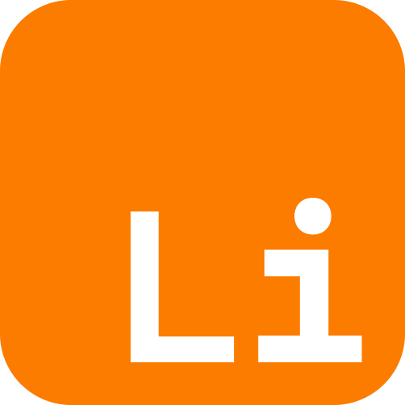

<a name="readme-top"></a>

[![Contributors][contributors-shield]][contributors-url]
[![Forks][forks-shield]][forks-url]
[![Stargazers][stars-shield]][stars-url]
[![Issues][issues-shield]][issues-url]
[![License][license-shield]][license-url]
[![GitHub Build][github-build]][github-build-url]

<!-- PROJECT LOGO -->
<br />
<div align="center">
  <a href="https://github.com/lithium_apps/extended-env">
    
  </a>

  <h3 align="center">@lithium/extended-env</h3>

  <p align="center">
    Extend env module for AdonisJS
    <br />
    <br />
    <a href="https://github.com/lithium-apps/extended-env/issues/new?labels=enhancement">Request Feature</a>
    ·
    <a href="https://github.com/lithium-apps/extended-env/issues/new?labels=bug">Report Bug</a>
    ·
    <a href="https://github.com/lithium-apps/extended-env/issues/new?labels=enhancement">Request Modification</a>
  </p>
</div>

<!-- TABLE OF CONTENTS -->
<details>
  <summary>Table of Contents</summary>
  <ol>
    <li>
      <a href="#about-the-project">About The Project</a>
      <ul>
        <li><a href="#built-with">Built With</a></li>
      </ul>
    </li>
    <li>
      <a href="#install-the-package">Install the package</a>
    </li>
    <li>
      <a href="#use-the-package">Use the package</a>
    </li>
    <li><a href="#contact">Contact</a></li>
  </ol>
</details>

<!-- ABOUT THE PROJECT -->

## About the project

The environment module extend the behavior of the default AdonisJS env module by adding support for Scaleway Secrets.

We welcome contributions and improvements to this module. Don't hesitate to submit features and improvements ;)

<p align="right">(<a href="#readme-top">back to top</a>)</p>

### Built With

-   [![TypeScript][TypeScript]][TypeScript-url]

<p align="right">(<a href="#readme-top">back to top</a>)</p>

<!-- INSTALL PACKAGE -->

## Install the package

For now the package isn't published to npm, but you can install it from the GitHub registry and can be installed in any project.

1.  You need to create a `.npmrc` file at the root of your project with the following content:

    ```sh
    @lithium-apps:registry=https://npm.pkg.github.com
    ```

2.  For the login process you need to set a personal access token with the `read:packages` scope.
    Then you can login to the GitHub registry with the following command:
    ```sh
    pnpm login --registry=https://npm.pkg.github.com --scope=@lithium-apps
    ```

   3. You can now install the packages using the following command:
       ```sh
       pnpm install @lithium-apps/extended-env
       ```

<p align="right">(<a href="#readme-top">back to top</a>)</p>


<!-- USE PACKAGE -->

## Use the package

1.  Replace the import of the default AdonisJS env module by the extended one in `start/env.ts`:

    ```typescript
    // import { Env } from '@adonisjs/core/env'; -- Replace this line
    import { Env } from '@lithium-apps/extended-env'; 
    ```

2.  Use the new modules when defining your schema:

    ```typescript
    import { Env } from '@lithium-apps/extended-env'; 

    export default await Env.create(new URL('../', import.meta.url), {
        NODE_ENV: Env.schema.enum(['development', 'production', 'test'] as const),
        PORT: Env.schema.number(),
        APP_KEY: Env.schema.string(),
        HOST: Env.schema.string({ format: 'host' }),
        LOG_LEVEL: Env.schema.enum(['fatal', 'error', 'warn', 'info', 'debug', 'trace', 'silent']),
    
        /*
        |----------------------------------------------------------
        | Variables for configuring database connection
        |----------------------------------------------------------
        */
        SECRET_DATABASE: Env.scaleway.database.optional({
            host: 'DB_HOST',
            port: 'DB_PORT',
            username: 'DB_USER',
            password: 'DB_PASSWORD',
            dbname: 'DB_DATABASE',
        }),
    
        DB_HOST: Env.schema.string.optionalWhen(() => Env.scaleway.exists('SECRET_DATABASE'), { format: 'host' }),
        DB_PORT: Env.schema.number.optionalWhen(() => Env.scaleway.exists('SECRET_DATABASE')),
        DB_USER: Env.schema.string.optionalWhen(() => Env.scaleway.exists('SECRET_DATABASE')),
        DB_DATABASE: Env.schema.string.optionalWhen(() => Env.scaleway.exists('SECRET_DATABASE')),
        DB_PASSWORD: Env.schema.string.optional(),
    });
    ```

<!-- CONTACT -->

## Contact

-   Kylian Mallet - [@Kylian-Mallet](https://github.com/Kylian-Mallet) - [kylian.mallet@sklav.group](mailto:kylian.mallet@sklav.group)

<p align="right">(<a href="#readme-top">back to top</a>)</p>

<!-- MARKDOWN LINKS & IMAGES -->
<!-- https://www.markdownguide.org/basic-syntax/#reference-style-links -->

[contributors-shield]: https://img.shields.io/github/contributors/lithium-apps/extended-env.svg?style=for-the-badge
[contributors-url]: https://github.com/lithium-apps/extended-env/graphs/contributors
[forks-shield]: https://img.shields.io/github/forks/lithium-apps/extended-env.svg?style=for-the-badge
[forks-url]: https://github.com/lithium-apps/extended-env/network/members
[stars-shield]: https://img.shields.io/github/stars/lithium-apps/extended-env.svg?style=for-the-badge
[stars-url]: https://github.com/lithium-apps/extended-env/stargazers
[issues-shield]: https://img.shields.io/github/issues/lithium-apps/extended-env.svg?style=for-the-badge
[issues-url]: https://github.com/lithium-apps/extended-env/issues
[license-shield]: https://img.shields.io/github/license/lithium-apps/extended-env.svg?style=for-the-badge
[license-url]: https://github.com/lithium-apps/extended-env/blob/main/LICENSE.md
[github-build]: https://img.shields.io/github/actions/workflow/status/lithium-apps/extended-env/brp-packages.yaml?branch=main&style=for-the-badge
[github-build-url]: https://github.com/lithium-apps/extended-env/actions/workflows/brp-packages.yaml

[TypeScript]: https://img.shields.io/badge/typescript-3178C6?style=for-the-badge&logo=typescript&logoColor=white
[TypeScript-url]: https://www.typescriptlang.org/